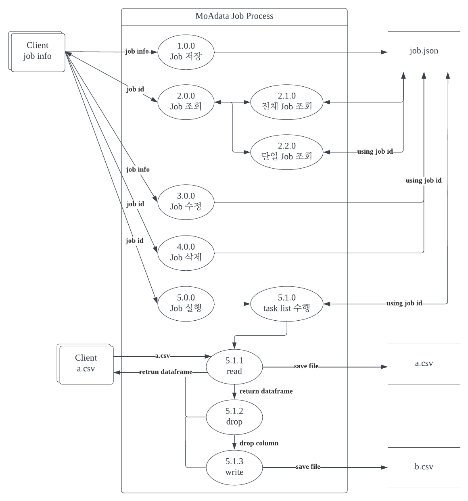

## 목차

- [프로젝트 개요](#Moadata_기업과제)
- [구현](#구현)
- [DFD Diagram](#DFD-Diagram)
- [Step to run](#Step-to-run)
- [Author](#Author)

# Moadata_기업과제
원티드 프리온보딩 코스_네번째 기업과제_모아데이타

### 팀 노션 [GoTo](https://www.notion.so/Moadata-71d8398156a349cf9af67421970f3cfb)
- 요구사항 분석, 정보 공유 및 프로젝트 진행을 위해 사용

### 배포주소
[Go To](http://52.78.203.26/client/)

### API 명세
[See Document](https://documenter.getpostman.com/view/16970494/UyxkmRe6)

## 과제 해석
이 서비스는 client가 데이터를 다루는데 필요한 작업(job)을 사전에 정의해두고, 원하는 데이터와 작업을 입력하여 해당 작업을 실행하는 서비스라고 해석하였습니다.

## 구현 요구사항
- REST API를 통한 통신
    - [x] 작업(job) CRUD
        - 작업(job) 정보 등록, 수정, 삭제
    - [x] 작업(job) 실행 API
        - read - drop - write라는 DAG개념 정립
        - CSV을 포함한 request ->  CSV 파일을 포함한 response

- [x] RESTAPI 각 기능에 대한 Unit test 실행
- [x] DFD diagram
- [x] API 명세서

## 구현

### 기술 스택
     

### 개발 기간
- 2022.05.17 - 2022.05.19

### DFD Diagram

### Step to run
~~~
$ virtualenv -p python3 venv
$ source venv/bin/activate
$ pip install -r requirements.txt

$ set FLASK_APP=flaskr
$ set FLASK_ENV=development
$ flask run
~~~

## Author
### 강정희
- 프로젝트 요구사항 분석
- job 실행 API
    - client가 작업을 수행할 데이터와 원하는 작업(job id)를 입력할 때 해당 작업을 실행
    - 입력한 데이터가 '.csv' 형식이 아니었을 경우, 원하는 작업이 사전에 정의되지 않았을 경우 400 code 리턴
    - 사전에 정의된 작업의 task list를 순서대로 실행 후 결과값 리턴
- 배포
    - AWS EC2, DOCKER를 이용한 배포
- DFD Diagram 작성

### 서재환
- template_view 작성
    - api 기능 별로 화면을 나누어 template_view를 활용하여 프론트 구성
- client request 부문 작성
   - jquery 사용하여 request 구현
   - request 성공 및 error에 대한 처리
### 김채욱
- job CRUD API
    - client의 job 정보를 저장, 수정, 삭제
    - job 실행을 위한 setting
- 배포
    - aws ec2에 nginx, gunicorn, docker
### 이형준
- 문서화 작업
  - readme
  - api document
- 테스트 코드 작성
  - pytest
  - unittest
